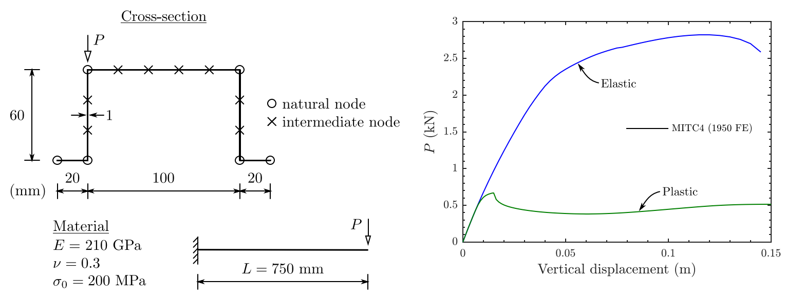
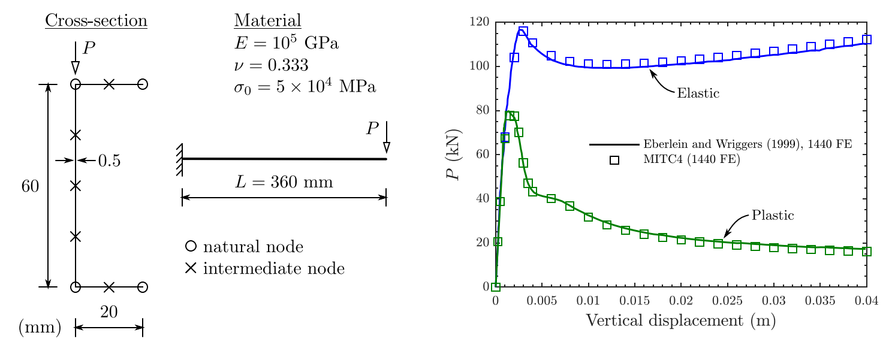
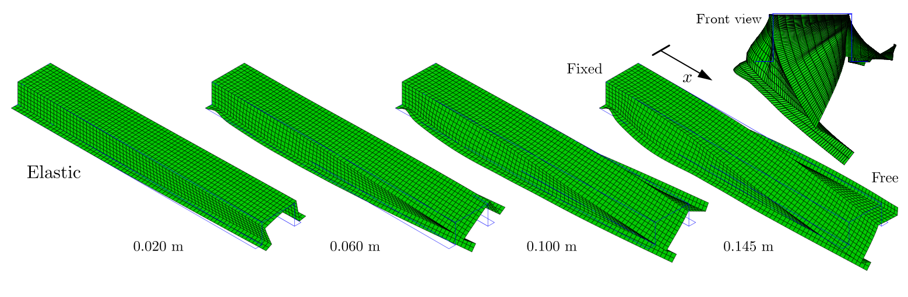
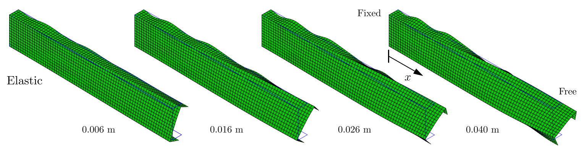
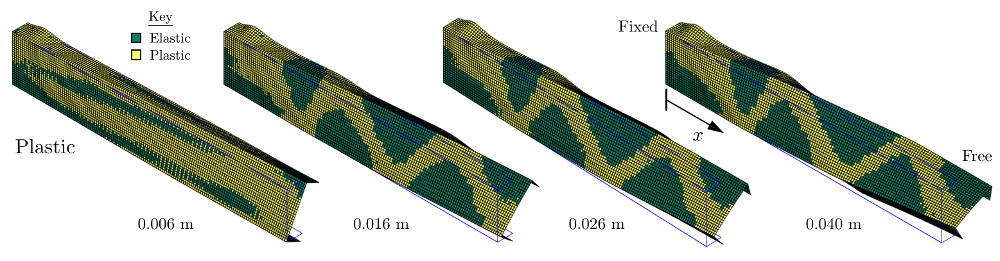
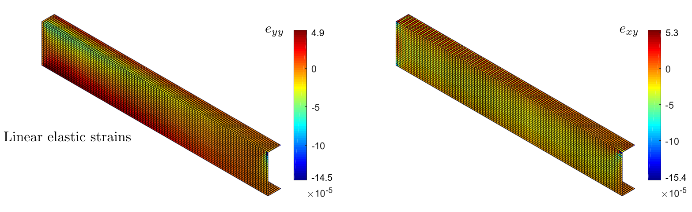

# Structural-stability

This program performs the structural stability of a structure.
It allows the user perform the analysis and 

* Calculates the non-linear load-displacement path, by Newton-Raphson method;
* Plot the load-displacement graph;

* Plot the deformed configurations;

* Plot the heat map of stresses/strains;

